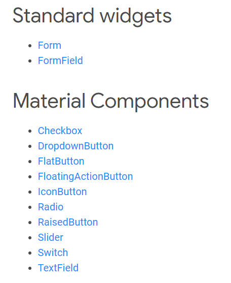

# Flutter

> 

> 모든 것이 위젯 단위로 구성된다.
>
> 변수의 값이 변경되면 자동으로 뷰가 변경되는 방식(리액티브 프로그래밍)을 따른다.
>
> - Android / Java 의 RxJava과 같은 기능이 기본으로 적용된다.
>
> 위젯은 아래와 같이 구분된다.
>
> 1. Stateful(속성 변경 가능) widget
>    -  그 자체는 변경이 불가능하지만, 변경된 상태를 State 클래스가 유지하는 구조
> 2. Stateless(속성 변경 불가) widget
>    - 모든 속성이 final변수


## 0. 위젯 ([위젯 카탈로그](https://flutter-ko.dev/docs/development/ui/widgets))

> ```dart
> flutter:
>   uses-material-design: true
> ```
>
> pubspec.yaml  파일에 위의 구문이 기재되어야 MatirialApp 위젯들을 사용할 수 있다.

---

### 0-1. 위젯의 종류


### 0-1-1. layout

> 크기, 여백, 컬러 등을 설정하여 화면의 Frame을 구성하는 역할을 한다.


#### 0-1-1-0. 공통사항

- 여백주기  : padding(내부), margin(외부)

  - EdgeInsets.~ 을 padding과 margin의 값으로 사용한다.

    -  .only(N) : 4방향 여백 (N)값으로 동일하게 주는 경우
    -  .symmetric(N1,N2) : 가로(좌우) 여백 (N1), 세로(위아래) 여백(N2)
    -  .fromLTRB(N1,N2,N3,N4) : Left(N1), Top(N2), Right(N3), Bottom(N4)

    

#### 0-1-1-1. Container

> 상하좌우 높이를 지정할 수 있는 Frame 공간 (가장 보편적으로 사용된다)

<details>
<summary>container_Method</summary>
<div markdown="1">
<table border = "1">
    <tr align = "center">
    	<p><td colspan = "4">method</td></p>
    </tr>
    <tr>
        <td>alignment</td>
        <td><span style="color:red">padding(내부 여백)</span></td>
        <td><span style="color:red">margin(외부 여백)</span></td>
        <td>color</td>
    </tr>
    <tr>
        <td>decoration</td>
        <td>foregroundDecoration</td>
        <td>width</td>
        <td>height</td>
    </tr>
        <tr>
        <td>constraints</td>
        <td>transform</td>
        <td>child</td>
        <td></td>
    </tr>
</div></details>

#### 0-1-1-2. Row

> 위젯이 가로로 나열되어야 할 경우, Row의 Children으로 놓는다.
>
> MainAxisAlignment와 CrossAxisAlignment를 통해 가로세로 정렬이 가능하다.

<details>
<summary>Row/Column_Method</summary>
<div markdown="1">
<table border = "1">
    <tr align = "center">
    	<p><td colspan = "4">method</td></p>
    </tr>
    <tr>
        <td><span style="color:red">MainAxisAlignment</span></td>
        <td><span style="color:red">CrossAxisAlignment</span></td>
        <td>MainAxisSize</td>
        <td>textDirection</td>
    </tr>
    <tr>
        <td>verticalDirection</td>
        <td>textBaseLine</td>
        <td><span style="color:red">Children = []</span></td>
        <td></td>
    </tr>
</div></details>

#### 0-1-1-3. Column

>위젯이 세로로 나열되어야 할 경우, Column의 Children으로 놓는다.
>
>MainAxisAlignment와 CrossAxisAlignment를 통해 세로가로 정렬이 가능하다.

<details>
<summary>Row/Column_Method</summary>
<div markdown="1">
<table border = "1">
    <tr align = "center">
    	<p><td colspan = "4">method</td></p>
    </tr>
    <tr>
        <td><span style="color:red">MainAxisAlignment</span></td>
        <td><span style="color:red">CrossAxisAlignment</span></td>
        <td>MainAxisSize</td>
        <td>textDirection</td>
    </tr>
    <tr>
        <td>verticalDirection</td>
        <td>textBaseLine</td>
        <td><span style="color:red">Children = []</span></td>
        <td></td>
    </tr>
</div></details>


### 0-1-2. 입력

> 입력을 받기 위한 Widget

#### 0-1-2-1. TextFormField

> Text를 입력할 수 있는 입력창 공간이 생성된다.

<details>
<summary>TextFormField_Method</summary>
<div markdown="1">
<table border = "1">
    <tr align = "center">
    	<p><td colspan = "4">method</td></p>
    </tr>
    <tr>
        <td>controller</td>
        <td><span style="color:red">initialValue</span></td>
        <td><span style="color:red">KeyboardType</span></td>
        <td>focusNode</td>
    </tr>
    <tr>
        <td>TextInputAction</td>
        <td>TextCapitalization</td>
        <td>style</td>
        <td>structure</td>
    </tr>
    <tr>
        <td>textDirection</td>
        <td>textAlign</td>
        <td>autofocus</td>
        <td>readOnly</td>
    </tr>
    <tr>
        <td>showCursor</td>
        <td>obscureText(입력 숨김)</td>
        <td>autocorrect</td>
        <td>autovalidate</td>
    </tr>
    <tr>
        <td>maxLengthEnForced</td>
        <td>MaxLines</td>
        <td>MinLines</td>
        <td>expands</td>
    </tr>
        <tr>
        <td>maxLength</td>
        <td>onEditingComplete</td>
        <td>onFieldSubmitted</td>
        <td>onSaved</td>
    </tr>
        <tr>
        <td>Validator</td>
        <td>inputFormatters</td>
        <td>enabled</td>
        <td>cursorWidth</td>
    </tr>
    <tr>
        <td>cursorRadius</td>
        <td>cursorColor</td>
        <td>keyboardAppearance</td>
        <td>scrollpadding</td>
    </tr>
        <tr>
        <td>enableInteaciveSelection</td>
        <td>buildCounter</td>
    </tr>
</div></details>

<details>
<summary>TextFormField_KeyBoardType</summary>
<div markdown="1">
<table border = "1">
    <tr align = "center">
    	<p><td colspan = "4">Type</td></p>
    </tr>
    <tr>
        <td>TextInputType.text<br> (일반 텍스트)</td>
        <td><span style="color:red">TextInputType.multiline<br> (메모)</span></td>
        <td><span style="color:red">TextInputType.number<br> (숫자)</span></td>
        <td>TextInputType.phone<br> (전화번호)</td>
    </tr>
    <tr>
        <td>TextInputType.datetime<Br> (날짜)</td>
        <td>TextInputType.emailaddress<br> (이메일)</td>
        <td>TextInputType.url<Br> (URL)</td>
    </tr>
</div></details>


- matirialApp

  - center

  - text [[링크]](https://flutter.dev/docs/development/ui/widgets/text)

    <details>
    <summary>text_Method</summary>
    <div markdown="1">
    <table border = "1">
        <tr align = "center">
        	<p><td colspan = "4">method</td></p>
        </tr>
        <tr>
            <td>style</td>
            <td>strutStyle</td>
            <td>textAlign</td>
            <td>textDirection</td>
        </tr>
        <tr>
            <td>locale</td>
            <td>softWrap</td>
            <td>overflow</td>
            <td>textScaleFactor</td>
        </tr>
            <tr>
            <td>maxLines</td>
            <td>semanticsLabel</td>
            <td>textWidthBasis</td>
            <td></td>
        </tr>
    </div></details>

    <details>
    <summary>Style_사용법</summary>
    <div markdown="1">
    |   text(<br>
    |    	style: TextStyle (<br>
    |    		color: Colors.color,<br>
    |    		background: Paint()<br>
    |    			..color = Color(hax code)<br>
    |    			..style = PaintingStyle.fill,<br>
    |    		backgroundColor : Color.color,		<br>
    |    		fontSize 	: 숫자,<br>
    |    		fontWeight 	:   	,<br>
    |    		fontStyle 	:		,<br>
    |    		letterSpacing :		,<br>
    |    		wordSpacing	:		,<br>
    |    		textBaseline :		,<br>
    |    		height		:		,<br>
    |    		locale		:		,<br>
    |    		foreground	:		,<br>
    |    		shadows		:		,<br>
    |    		fontFeatures	:	,<br>
    |    		decoration	:		,<br>
    |    		decorationColor:		,<br>
    |    		decorationStyle:		,<br>
    |    		decorationThickness :		,<br>
    |    		debugLabel	:		,<br>
    |    		String fontFamily,<br>
    |    		List<String> fontFamilyFallback,<br>
    |    		String package<br>
    |    	)<br>
    |    )<br>
    </div></details><br>

  - stack

  - icon [[링크]](https://flutter.dev/docs/development/ui/widgets/assets)

  - image  [[링크]](https://flutter.dev/docs/development/ui/widgets/assets)

  - 스크롤페이지

  - Button

    <details>
    <summary>Button_type</summary>
    <div markdown="1">
        <table border = "1">
    
        <tr>
            <td>ResizedButton</td>
            <td>FlatButton</td>
            <td>DropDownButton</td>
            <td>FloatingActionButton</td>
       </tr>
    </div></details>

    <details>
    <summary>Button_Method</summary>
    <div markdown="1">
        <table border = "1">
        <tr align = "center">
        	<p><td colspan = "5">method</td></p>
            </tr>
        <tr align = "center">
        	<p><td colspan = "5">Onclick () function은 필수로 선언되어야 한다.</td></p>
            </tr>
        <tr>
            <td>Color</td>
            <td>textColor</td>
            <td>disabledTextColor</td>
            <td>color</td>
            <td>disabledcolor</td>
       </tr>
       <tr>
            <td>focusColor</td>
            <td>hoverColor</td>
            <td>highlightColor</td>
            <td>SplashColor</td>
        	<td>colorBrightness</td>
       </tr>
        <tr>
        <td>elevation</td>
        <td>focuselevation</td>
        <td>hoverelevation</td>
        <td>highlightelevation</td>
        <td>disabledelevation</td>
    </tr>
    <tr>
        <td>etc</td>
        <td>padding</td>
        <td>shape</td>
        <td>clipBehavior</td>
        <td>focusNode</td>
    </tr>
        <tr>
        <td>etc</td>
        <td>materialTapTargetSize</td>
        <td>animationDuration</td>
        <td>child(버튼에 들어갈 내용)</td>
    </tr>
    </div></details>

    

- 위젯 (

  ​           body : 위젯 (보통 Contaienr) 

  ​           child : 위젯

  ​		   children: <Widget> [ 위젯 list ]

  ​           ) 

- matirialApp을 사용하면 App 전체의 타이틀, home 설정, Appbar 및 bar 제목 설정 가능 


### 0-1_. 특수 위젯

- **ListView**

  ```dart
  Widget _buildList() => ListView(
        children: [
          _tile('title', 'subtitle', Icons.theaters),
         ],
  )
      
  ListTile _tile(String title, String subtitle, IconData icon) => ListTile(
        title: Text(title,
            style: TextStyle(
              fontWeight: FontWeight.w500,
              fontSize: 20,
            )),
        subtitle: Text(subtitle),
        leading: Icon(
          icon,
          color: Colors.blue[500],
        ),
      );
  ```


위젯에 키API를 사용하면 위젯의 순서를 변경, 정렬할 수 있다.

키 개념 설명 : [링크](https://api.flutter.dev/flutter/foundation/Key-class.html)


- SizedBox,


### 0-2. 위젯의 속성

> Ex_
>
> ​	위젯(
>
> ​	속성  : 값
>
> ​	color : _lights ? Colors.yellow.shade600 : Colors.black,
>
> ​	)
>
> 각 위젯별 속성들이 존재한다. (정렬, 컬러, 위치 등은 공통 속성이다. : 웹과 동일)


### 0-3. 위젯의 GestureDetector

[class 설명 링크](https://api.flutter.dev/flutter/widgets/GestureDetector-class.html)

> EX_
>
> GestureDetector(
>
> ​		onTap: () { 실행 내용 },
>
> ​        child : Container (내용)
>
> )
>
> 위의 내용처럼 onAction에 대한 Detector를 선언할 수 있다.


**Detector가 인식할 수 있는 Action의 종류**

---

<details>
<summary>Action종류 접기/펼치기 버튼</summary>
<div markdown="1">
1. OnTap(Cancel, Down, Up)<br>
2. OnDoubleTap<br>
3. OnForcePress(End, Peek, Start, Update)<br>
4. OnHorizontalDrag(Cancel, Down, End, Start, Update)<br>
4. OnVerticalDrag(Cancel, Down, End, Start, Update)<br>
5. OnLongPress(End, MoveUpdate, Start, Up)<br>
6. OnPan(Cancel, Down, End, Start, Update)<br>
7. OnScale(End, Start, Update)<br>
8. OnSecondaryTap(Cancel, Down, Up)<br>
</div></details>

---


### 0-4. 위젯의 상태 변화

> 위젯의 형태는 변화하지 않는다.
>
> 상태에 변화를 주기위해서는 변화를 저장하는 Status Class를 따로 생성해준다.
>
> 그 방법은
>
> 1. StatefulWidget을 상속받는 Class를 생성
>
>    createState() 를 override한다.
>
> 2. State<1번에서 생성된 Class>를 상속받는 SubClass 를 만든다. 여기에 저장될 상태들에 대한 정의가 기재된다.
>
> 3. 특정 위젯의 Box하위에 1번에서 만든 Class의 createState method의 override된 이름을 통해 실행한다.



- [링크](https://flutter-ko.dev/docs/development/ui/interactive) 최 하단


## 1. flutter 프로젝트의 기본 구성

### 1-1. 프로젝트

- lib 
  - **main.dart**  : 실행 파일 
  - 모델 폴더     : 데이터의 형태 정의
  - 페이지 폴더  : view 정의

- pubspec.yaml : 환경설정 파일 (Assets 경로, dependancy)
- 다른 폴더나 파일은 디버깅 시 컴파일되어 자동생성


## 2. main.dart

### 2-1. import

- import 'package:경로'

  - 예시 1. import 'package:flutter/material.dart';
  - 예시 2. import 'package:googleapis/storage/v1.dart';

- App 실행

  - ```dart
    void main() => runApp(App());
    ```

- App 선언부

  - ```dart
    class App extends StatelessWidget {
    
      @override
      Widget build(BuildContext context) {
    
        return MaterialApp(
          home: 실행하고자 하는 import된 메소드,
        );
      }
    }
    ```

    *위의 build 위젯의 return 문이 화면 구성에 해당된다.*


### 3. Assets 관리


## 4. 비동기 통신

### 4-1. future

### 4-2. Stream

### 4-3. async & await


