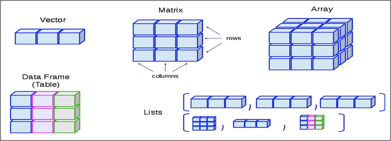

# R

> [오픈소스] 통계용 프로그래밍 언어

- 객체 지향


## [시작] - 설치 / 설정 / 단축키

###### 1. 다운로드

​	[R 다운로드](https://cran.seoul.go.kr/) - 기본 엔진 다운로드

​	[R-studio 다운로드](https://www.rstudio.com/products/rstudio/download/#download) - R IDE


###### 2. 환경설정

​	[Tools - Global Options... ] - 설정창

> => General : Default working... 설정 시 워크 스페이스 설정 가능 
> => Code : Saving : Default text encoding - change  기본 저장 형식 UTF-8 설정 가능


###### 3. 단축키 (R - studio) 

​	컨트롤+쉬프트+N = 새 스크립트 창 열기

​	실행 : ctrl+enter = 부분 / ctrl + alt + enter = 전체 / ctrl + shift + enter = 직전 명령어 재실행


###### 4. [운영 명령어](https://github.com/HaYongdae/TIL/blob/master/R/src/start_R.R)

```R
#기준시간 현재 위치 시간으로 변경
Sys.setlocale(category = "LC_ALL", locale = "")
#locale = "국가명" -> ex_ "Korean_Korea" , "English_US", "Japanese_Japan" 
Sys.getlocale()

#현재 workspace 확인
getwd()
setwd("경로")

# R페키지 개수 확인
dim(available.packages())
available.packages()

# R session - R콜솔 시작 ~ 종료)
# R 프로그램 버전, 운영체제, 지원 언어, 기본 패키지 조회
sessionInfo()

# 설치된 R 패키지의 목록 확인 - 우하단의 Packages에서 확인 가능
installed.packages()

# R패키지 설치
install.packages("package_name")
update.packages("package_name")
remove.packages("package_name")

# 설치된 패키지를 사용하기 위해서 메모리에 로드
library(package_name)
require(package_name)

# 로드된 자원 조회
search()

#기본 데이터셋 조회
data()

# 메모리에 케시된 모든 데이터 목록
ls()

# help 또는 ? : 도움말 시스템을 호출
# help.search 또는 ?? : 주어진 문자열이 포함된 문서 검색
# help.start : 시스템 전반에 대한 도움말
# example : topic의 도움말에 있는 Examples 섹션 실행
# args(함수) : 함수의 파라미터 형식 조회
```


---


## [기초] - 변수 / 객체 / IO / 연산자

### 1. 변수

---

#### 1-1. 네이밍 규칙

---

- 첫 문자는 알파벳 (대소문자 구분)

- 두 번째부터는 숫자, _(언더 바), .(콤마) 사용가능
- 예약어 사용 불가
- 변수에 저장된 값은 불가


#### 1-2. 변수 TYPE

| 숫자형(Numeric) – integer, double                         |
| --------------------------------------------------------- |
| 산술   연산자 +, -, *, / , %%, ^, **                      |
| Character (문자형) – “a”, “abc”                           |
| NA   (Not Applicable) - '불가능, 오류'의 의미             |
| NULL  -  '아직 정해진 값이 없다'를 의미                   |
| Logical – True(t), False(F)                               |
| 날짜와 시간 : Sys.Date(), Sys.time(), date(),   as.Date() |
| Object - Factor, Vector, Scalar, Metrix,   Array          |
| Collection Object – List , Data Frame                     |


#### 1-3. [변수 조회/변환 메소드](https://github.com/HaYongdae/TIL/blob/master/R/src/R_var.R)

```R
############### 변수 관련 메소드 ##################

tracemem(x) # 변수의 address값

# 변수의 class TYPE 값
class(x)    
mode(x)     
typeof(x)

Re(z) #숫자형 자료의 실수부만  반환
Im(z) #숫자형 자료의 허수부만  반환


# is.형태(변수명) 으로 T/F 반환
is(x)
is.numeric(x)
is.logical(x)
is.character(x)
is.na(x)
is.list(x)
is.data.frame(x)
is.array(x)
is.matrix(x)

# as.형태(변수명) 으로 T/F 반환
as(x)
as.numeric(x)
as.logical(x)
as.character(x)
as.na(x)
as.list(x)
as.data.frame(x)
as.array(x)
as.matrix(x)
as.integer(x)
as.double(x)
as.complex(x)
as.factor(x)
as.Date(x, format='%d-%m-%y')
```


#### 1-4 변수 TYPE별 메소드

---

##### 1-4-1. Date 메소드

```R
### Date 형 

sys.Date()
sys.time()
now()

# format 변경

#as.Date('날짜', format='%d-%m-%y') 형태

# %d = 일자(숫자), %m = 월(숫자), %b = 월(영어), %B = 월(영어 전체)
# %y = 연도(숫자 2자리), %Y = 연도(숫자 4자리)


# 날짜/시간 계산

# POSIXt : 날짜를 년,월,일로 표시하는 리스트 클래스
# POSIXct: 날짜를 연속적 데이터로 인식, 1970년을 기준으로 초 단위로 계산

as.Date("2017-07-04 20:00:00 ")-as.Date("2017-07-04 18:30")
as.POSIXct("2017-07-04 20:00:00 ")-as.POSIXct("2017-07-04 18:30")

######################
```


### 2. 객체

---

#### 2-1 객체 TYPE

|  구분  | 1차원  |     2차원     | N차원 |
| :----: | :----: | :-----------: | :---: |
| 단일형 |  백터  |     행렬      | 배열  |
| 다중형 | 리스트 | 데이터 프레임 |  ---  |



+Factor

- 범주형 데이터의 대표값을 반환하는 TYPE  (stringsAsFactors=FALSE 옵션은  중복상태 그대로를 사용)
  범주형Categorical 데이터 - 1. 명목형Nominal (대소관계 X) / 2. 순서형Ordinal (대소관계 O)

#### 2-2. [객체 메소드](https://github.com/HaYongdae/TIL/blob/master/R/src/R_data.R)

##### 2-2-1. 공통

```R
# 생성: <- 를 통해 자료 입력
# 제거: remove, rm 메소드 사용
# 형태: str(객체) = 구조,변수개수,변수명,관찰치 개수,관찰치의 미리보기
# 조회: head(), tail()
# 차원: dim()
# 길이: length()
# 이름: names(객체) <- c(백터)  ## 기존의 값에 인댁스 이름을 지정
# 타입: class()
# 정렬: sort(객체, decreasing = TRUE/FALSE)
```

##### 2-2-2. Vector

```R
## 1*n (vector) - 단일형(한가지 종류의 자료형만만 포함할 수 있음) ##

# 생성 : c(), seq(), rep()
vector_int <- c(-1,0,1)
vector_int <- seq(1,20)
vector_int <- rep(1:3,each = 3)
vector_int <- c(-1,0,"4",5:9) # 문자열로 자동 형변환
vector_str <- c("hello","hi","1")
vector_tf <- c(TRUE,FALSE,TRUE,FALSE)
vector_appendedV <- append(vector_int, 99, after=1) # after = 인덱스 값

a<- c(1:20)
b<- c(2,3,4,5)
d<- c(1:20)
e<- c(20:1)
f<- c(2:21)

# 연산
union(a,b)
setdiff(a, b)
intersect(a, b)
identical(a, e) # 두 객체의 데이터 개수, 순서가 일치하는가
setequal(a, e)  # 두 객체의 데이터가 일치하는가 (순서 상관 x)

# 접근
a[1:2]
a[c(1)]
a[-c(2:18)]
```

##### 2-2-3. Matrix

```R
## n*n (matrix) - 단일형 ##

# 생성: matrix(data, (nrow), (ncol),(byrow),(dimnames))
x <- c(1,2,3,4,5,6)
matrix_23 <- matrix(x, nrow=2, ncol=3)
matrix_32 <- matrix(x, nrow=3, ncol=2)             # 위에서 아래로 채워감
matrix_32FLTR <- matrix(x, nrow=3, ncol=2, byrow=T)    # 왼쪽에서 오른쪽으로 채워감
matrix_32dimnames <-matrix(x, nrow=3, ncol=2, dimnames("첫째"))
matrix_T <- t(matrix_23) # 전치행렬
matrix33 <-rbind(matrix_23,c(1,2,3))
matrix_S <- solve(matrix_33)


# 변형: rbind(m1,m2), cbing(m1,m2)
matrix_33 <- rbind(matrix_23, c(1,2,3))
matrix_24 <- cbind(matrix_23, c(1,2))

# 명명: dimnames(rownames, colnames
# 조회: rownames(matrix), colnames(matrix)

rownames <- c("row1", "row2", "row3", "row4")
colnames <- c("col1", "col2", "col3")
matrix_hasNames <- matrix(c(3:14), nrow = 4, byrow = TRUE, dimnames = list(rownames, colnames))

# 접근:
matrix_23[1,3]
matrix_23[2,]  #2행 전체 요소에 접근
matrix_23[,3]   #3열 전체 요소에 접근
matrix_hasNames["row1",]  #1행 전체 요소에 접근
matrix_hasNames[,"col3"]   #3열 전체 요소에 접근
matrix_NotHasNames <- matrix(matrix_hasNames,nrow(matrix_hasNames), ncol(matrix_hasNames),F, dimnames(NULL))
matrix_NotHasNames
# 연산:

result <- matrix_23 + 10 * 2

# apply함수(행렬객체, margin(1:행,2:열),function)을 활용한 예제

f <- function(x) {  #사용자 정의 함수 
  x*c(1,2,3)
}
result <- apply(matrix_23, 1, f)
print(result)

result <- apply(matrix(1:9, ncol=3), 2, f)
print(result)
```

##### 2-2-4. Array

```R
## n*n*n (array) - 단일형 ##

# 생성
y <- c(1,2,3,4,5,6)
array(y, dim = c(2,2,3), dimnames = "matrix.names 지정 가능")

# 접근
ex_array[1,3,2] #형식으로 접근
```

##### 2-2-5. List

```R
## 1*n (list) - 다중형 (여러가지 종류의 자료형을 포함할 수 있음) ##


# 생성
ex_list <- list(c(1,2,3), "hello")

# 추가

ex_list$text <- 1

#lapply 함수 ( list 반환)
a <- list(c(1:5))
b <- list(6:10)
result <- lapply(c(a,b),max)
result
str(result)

#sapply 함수 ( vector 반환)
result <- sapply(c(a,b),max)
str(result)

# 중첩 리스트
multi_list <- list(c1 = list(1,2,3),
                   c2 = list(10,20,30),
                   c3 = list(100,200,300))
#다차원 리스트 -> 열단위 바인딩
do.call(cbind, multi_list)

```

##### 2-2-5. DataFrame

```R
## n*n (data.frame) - 다중형 ##


###########################################################
# DataFrame - 데이터베이스의 테이블 구조와 유사
# R에서 가장 많이 사용하는 자료구조
# 컬럼 단위로 서로 다른 데이터 유형(type)을 저장 가능
# 리스트와 벡터의 혼합형으로 컬럼은 리스트, 컬럼 내의 데이터는 벡터 자료구조를 갖는다
# DataFrame 생성함수 - data.frame(), read.table(), read.csv()
# txt, excel, csv 파일로부터 DataFrame 생성
# data.frame(컬럼1=자료, 컬럼2=자료, ...컬럼n=자료)
########################################################### 
#여러 개의 벡터 객체를 이용하여 데이터프레임을 생성할 수 있다. 
#이때 모든 컬럼은 길이가 같아야 한다. 컬럼의 길이가 서로 다르면 오류가 발생한다.

# 생성
# 1.
ID <- c(1,2,3,4,5,6,7,8,9,10)
SEX <- c("F","M","F","M","F","M","F","M","F","M")
AGE <- c(50,40,28,50,27,23,56,47,20,38)
AREA <- c("서울","경기","제주","서울","서울","서울","서울","경기","서울","인천")

dataframe_ex <- data.frame(ID = ID,SEX = SEX,AGE = AGE,AREA =AREA)

# 2.
sales1 <- matrix(c(1,'Apple' ,500,5,
                   2,'Peach' ,200,2,
                   3,'Banana',100,4,
                   4,'Grape' ,50 ,7), nrow=4, byrow=T)
str(sales1)
df1 <- data.frame(sales1)
df2 <- data.frame(sales1, stringsAsFactors = FALSE)  # 값을 Factor가 아닌 chr로 만든다.
names(df2) <-c('NO','Fruit','Price','Qty')
# 내용 변환
# as.numeric()함수 사용
df2$Qty <- as.numeric(df2$Qty)
df2$Price <- as.numeric(df2$Price)
str(df2)
#data.frame 요소에 접근 : 변수명$컬럼명 형식으로 요소 접근, 결과는 벡터로 반환
print(df2$Qty) #컬럼이름으로 data.frame 의 특정 컬럼 데이터 모두 access

#데이터프레임에 새로운 열 추가
dataframe_ex$work <- c(T,T,F,F,T,F,T,T,T,F)  
str(dataframe_ex)


# subset(데이터프레임 객체, 조건) : 조건에 만족하는 행을 추출, 독립된 객체를 생성
# df1 데이터 프레임에서 수량이 5보다 큰 추출 출력
subset.df1 <- subset(df2, Qty>5)
subset.df1
str(subset.df1)

df2<-data.frame(x=c(1:5), y=seq(2, 10, 2), z=c('a', 'b', 'c', 'd', 'e'))
#summary()는 데이터프레임 객체의 데이터를 대상으로 최소값, 최대값, 중위수, 평균, 사분위수 값을 요약하여 반환
summary(df2)

df4 <- data.frame(name = c(1,2,3,4))
df5 <- data.frame(name = c(3,4,5,6))

result <- merge(df4, df5, all = T)

# 추가
dataframe_ex$tel <- "010-1111-2222"
```

##### 2-2-6. Factor

```R
### factor ##

gender <- c("man","woman", "woman", "man", "man")
# plot(gender) 사용이 불가능 - 차트는 수치 데이터로 생성됨

ngender <- as.factor(gender) #범주의 순서가 알파벳 순서로 정렬됨
# 범주의 빈도 확인 가능 옵션 , levels 지정 후, ordered
ogender <- factor(gender, levels<-c("woman","man") ,  ordered=T)


# 아래 코드로 비교 실습
table(ngender)
table(ogender)
par(mfrow=c(1,2))
plot(ngender)
plot(ogender)
```


### 3. IO

---

#### 3-1. Directory 탐색

```R
#현재 working directory출력
getwd()

#현재 working directory의 파일 목록 출력
print(list.files())
print(list.files(recursive = T)) 
print(list.files(all.files = T)) # 모든 파일을 다 보여준다.

# 파일 탐색기 실행
file.choose()
# read.xlsx(file.choose(),sheetIndex=1,encoding="UTF-8")
```

#### 3-2. 불러오기 (csv, txt)

```R
## EXCEL 파일

install.packages("xlsx")   
install.packages("rJava")   # rJava(xlsx 의 상위 패키지) 패키지 설치 

install.packages("readxl")

library(xlsx)
library(rJava)

library(readxl)


excel_data_ex <- read_excel("경로", (sheet = n))
choosing_excel_data <- read.xlsx(file.choose(),sheetIndex=1, encoding="UTF-8")

##TXT

################################################
#텍스트파일 읽기 readLines(), read.table()
################################################
#아래 내용을 메모장에 작성해서 작업디렉토리의 datas디렉토리 아래 fruits.txt로 저장하세요
#no  name  price   qty  
#1   apple   500     5  
#2   banana  200     2  
#3   peach   200     7  
#4   berry    50     9  

# 텍스트 파일 읽기, 라인 단위를 문자열로 로딩, 라인단위로 저장되는 벡터 객체로 생성함
file1 <- readLines("./data/fruits.txt")  
print(file1)
str(file1)

#텍스트 파일의 내용을 읽어서 data.frame객체로 생성함
data <- read.table("경로/파일") 
data <- read.table("경로/파일", header=T)
data <- read.table("경로/파일", header=T, stringsAsFactor=FALSE)
data <- read.table("경로/파일", header=T, skip = n부터, nrows = n까지, sep="구분자" col.names = "이름 백터")


```

#### 3-3. 내보내기 (csv, txt)

```R
###### O

## SAVE, LOAD

save(데이터, file ="저장할 파일명.rda")
load("경로명")
write.csv(데이터, file = "파일명.csv")
write.table(데이터, file = "파일명.txt")
```

#### 3-4. XML IO

```R
###
# XML데이터
################################################

install.packages("XML")
library(XML)


data2 <- xmlParse(file = "C:/Users/student/Desktop/git_repository/R/data/employees.xml")

print(data2)

#Root NODE만 추출
rootnode <- xmlRoot(data2)
#ROOT NODE 자식 노드 갯수
rootSize <-xmlSize(rootnode)
rootnode[1]
rootnode[[1]][[3]]

#xml을 R의 지원형식인 data.frame 으로 로딩
xmldataframe <- xmlToDataFrame("C:/Users/student/Desktop/git_repository/R/data/employees.xml" ,stringsAsFactors=FALSE)
str(xmldataframe)
```

#### 3-5. JSON IO

```R
###
# JSON 데이터
################################################

install.packages("rjson")
library(rjson)

jsonEmp <- fromJSON(file = "C:/Users/student/Desktop/git_repository/R/data/employees2.json")

# dataframe 변환
emp.dataframe <- as.data.frame(jsonEmp)

# 저장
result <- toJSON(emp.dataframe)
write(result, "C:/Users/student/Desktop/git_repository/R/data/employees2.json")
list.files("C:/Users/student/Desktop/git_repository/R/data/")
```

#### 3-6. HTML IO

```R
###
# HTML 데이터
################################################

# httr 패키지는 지정한 url의 HTML소스를 가져오는 GET() 함수를 제공하고
# <table> 태그의 내용을 읽어올 수 있는 readHTMLTable()함수를 제공합니다.
# readHTMLTable()에 사용되는 속성 
# - get_url$content  : GET(url)함수에 의해서 가져온 HTML소스의 내용
# - rawToChar() : 바이너리(binary) 소스를 HTML 태그로 변환
# - stringsAsFactors = F : 문자열을 요인으로 처리하지 않고 순수한 문자열로 가져오기

# https://ssti.org/blog/useful-stats-capita-personal-income-state-2010-2015

install.packages("httr")
library(httr)

url <- "https://ssti.org/blog/useful-stats-capita-personal-income-state-2010-2015"
get_url <- GET(url)
html_cont <- readHTMLTable(rawToChar(get_url$content), stringsAsFactors=FALSE)
str(html_cont)
View(html_cont)
html_cont.dataframe <- as.data.frame(html_cont)
str(html_cont.dataframe)

## 컬럼의 이름에 NULL이 붙기 때문에 변경해준다. (이 과정을 생략하는 방법은 ??)
names(html_cont.dataframe) <- c("State", "y2010", "y2011","y2012", "y2013", "y2014", "y2015")
str(html_cont.dataframe)
```

#### 3-7. sink (결과 자동 저장)

```R
###
# sink()로 열기 - 명령어의 내역이 모두 자동 저장된다.
################################################

sink("C:/Users/student/Desktop/git_repository/R/data/data.csv", "a")
url <- "https://ssti.org/blog/useful-stats-capita-personal-income-state-2010-2015"
get_url <- GET(url)
html_cont <- readHTMLTable(rawToChar(get_url$content), stringsAsFactors = F)
str(html_cont)
class(html_cont)
print(html_cont)
html_cont <- as.data.frame(html_cont)
head(html_cont)
str(html_cont)
class(html_cont)
names(html_cont) <- c("State", "y2010", "y2011","y2012", "y2013", "y2014", "y2015")
tail(html_cont)
sink()             #오픈된 파일 close
```


---


### 4. 연산자


### 5. 조건문

---

#### 5-1. if문

```R
# if(조건식) {참인 경우 처리문 } else { 거짓인 경우 처리문}
x<-3
y<-5
if(x*y >= 30) {
  cat("x*y의 결과는 30이상입니다.\n")
}else {
  cat("x*y의 결과는 30미만입니다.\n")
}
```


#### 5-2. ifelse구문

```R
# ifelse(조건식, 참인 경우 처리문, 거짓인 경우 처리문)
ifelse(num%%2==0, "짝수", "홀수")
```

#### 5-3. which구문

```R
# which(조건)  : 벡터 객체를 대상으로 특정 데이터를 검색하는데 사용되는 함수
# which() 함수의 인수로 사용되는 조건식에 만족하는 경우 벡터 원소의 위치(인덱스)가 출력되며, 조건식이 거짓이면 0이 출력된다.

names <- c("kim", "lee", "choi", "park")
which(names == "choi") # 인덱스 값 반환 - 데이터 프레임 검색에 사용가능
```

#### 5-4. 반복문

```R
# for(변수 in 자료구조변수) {실행문} : 지정한 횟수만큼 실행문을 반복 수행
# while(조건) { 실행문 }  : while블럭안에 증감식 포함
# repeat { 반복 수행문장 ; 반복문 탈출할 조건문; 증감식 }
```

#### 5-5. swich 구문

```R
#switch (비교문, 실행문1, 실행문2, 실행문3,...)
#비교문의 변수의 값이 실행문에 있는 변수와 일치할때 , 해당 변수에 할당된 값이 출력됩니다.
#사원이름을 입력 받아서 해당 사원의 급여 출력
ename <- scan(what="")   # hong 입력
switch(ename, hong=250, lee=300, park=350, kim=200) # 250 출력
```


---

---


### 6. 함수 (내장함수 + UDF)

> 함수 : 코드의 집합
> 함수명 <- function(매개변수) { 실행문 }

> * 함수 내부의 변수를 전역변수로 선언하고 싶을 때 <<- 를 사용한다.

```R
# 함수의 매개변수로 함수 전달 가능
callee <- function(x){
  print(x*2)
}
caller <- function(v, call){
  for (i in v) {
    call(i)
  }
}

print(caller(1:5, callee))

# 함수 내부 변수를 전역변수로 선언하는 방법

g1 <- 1000
f7 <- function(){
  g1 <<- 100   # <<- 사용
  print(g1 + g1) 
}
print(f7())
print(g1)

# 변수에 함수 선언
f8 <- function(num1){
  local <- num1
  return (function(num2) {
    return (local+num2)
  })
}
result.function <- f8(100)  #함수 리턴
str(result.function)
print(result.function(200))

```


#### 6-1. 매개변수 없는 함수

```R
#매개변수 없는 함수
f1 <- function(){
   cat("매개변수 없는 함수")
}
f1() #함수 호출
```

##### 6-1-1. 난수 생성 함수

```R
#############################################################################
# rnorm() : 정규분포(연속형)의 난수 생성, 평균과 표준편차를 이용
# rnorm(생성할 난수 개수, mean , sd)

# runif() : 균등분포(연속형)의 난수 생성 , 최소값과 최대값을 이용
# runif(생성할 난수 개수, min, max)

# rbinom() : 이산변량(정수형)을 갖는 정규분포의 난수 생성
# seed값을 지정하면 동일한 난수를 발생시킬 수 있다
#############################################################################
```

#### 6-2. 매개변수 있는 함수

```R
#매개변수가 있는 함수
f2 <- function(x){
    if(x%%2==0) print(n)
}
f2(11)    #함수 호출
```

##### 6-2-1. 통계함수

> 함수(데이터, trim = n(양극단에서 제거할 값의 개수), na.rm = T/F (NA값을 변량에서 제외))

```R
# 기술 통계량 처리 관련 내장함수
min(vec) 	#최소값
max(vec) 	#최대값
range(vec) 	#범위
mean(vec)  	#평균
median(vec)	#중위값
sum(vec)	#합계
sort(x)		#정렬
order(x) 	#벡터의 정렬된 값의 색인(index)을 보여주는 함수
rank(x)		#
sd(x)		#표준편차
summary(x)	#요약
table(x)	#??
sample(x, y)# x 범위에서 y만큼 sample 데이터를 생성하는 함수
```

##### 6-2-2. 수학함수

```R
#############################################################################
수학 관련 내장 함수
abs(x) 							# 절대값(+)
sqrt(x)							# 루트값
ceiling(x), floor(x), round() 	# 올림, 내림, 반올림
factorial(x)					# 팩토리얼
which.min(x) / which.max(x) 	# 벡터 내 최소값과 최대값의 인덱스를 구하는 함수
pmin(x) /pmax(x) 				# 여러 벡터에서의 원소 단위 최소값과 최대값
prod() 							# 벡터의 원소들의 곱을 구하는 함수
cumsum() / cumprod() 			# 벡터의 원소들의 누적합과 누적곱을 구하는 함수
cos(x), sin(x), tan(x)  		# 삼각함수
log(x) 							# 자연로그
log10(x) 						# 10을 밑으로 하는 일반로그 함수
exp(x) 							# 지수함수
###############################################################
```

##### 6-2-3. 행렬함수

```R
###############################################################
#행렬연산 관련 내장 함수
ncol(x) 				# x의 열(컬럼) 수를 구하는 함수
nrow(x) 				# x의 행 수를 구하는 함수
t(x) 					# x 대상의 전치행렬을 구하는 함수
cbind(...) 				# 열을 추가할 때 이용되는 함수
rbind(...) 				# 행을 추가할 때 이용되는 함수
diag(x) 				# x의 대각행렬을 구하는 함수
det(x) 					# x의 행렬식을 구하는 함수
apply(x, m, fun) 		# 행 또는 열에 지정된 함수를 적용하는 함수
solve(x) 				# x의 역행렬을 구하는 함수
eigen(x) 				# 정방행렬을 대상으로 고유값을 분해하는 함수
svd(x) 					# m x n 행렬을 대상으로 특이값을 분해하는 함수
x %*% y 				# 두 행렬의 곱을 구하는 수식
###############################################################
```

#### 6-3. 결과 반환 함수

```R
#결과 반환 함수
f3 <- function(a, b){
    add <- a+b
    return(add)
}

result <- f3(11, 4)    #함수 호출
print(result)
```

