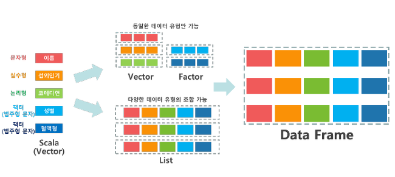

# R

> [오픈소스] 통계용 프로그래밍 언어

- 객체 지향


## [시작] - 환경 설치/설정 , 단축키

###### 1. 다운로드

​	[R 다운로드](https://cran.seoul.go.kr/) - 기본 엔진 다운로드

​	[R-studio 다운로드](https://www.rstudio.com/products/rstudio/download/#download) - R IDE


###### 2. 환경설정

​	[Tools - Global Options... ] - 설정창

> => General : Default working... 설정 시 워크 스페이스 설정 가능 
> => Code : Saving : Default text encoding - change  기본 저장 형식 UTF-8 설정 가능


###### 3. 단축키 (R - studio) 

​	컨트롤+쉬프트+N = 새 스크립트 창 열기

​	실행 : ctrl+enter = 부분 / ctrl + alt + enter = 전체 / ctrl + shift + enter = 직전 명령어 재실행


###### 4. [운영 명령어](https://github.com/HaYongdae/TIL/blob/master/R/src/start_R.R)

```R
#기준시간 현재 위치 시간으로 변경
Sys.setlocale(category = "LC_ALL", locale = "")
#locale = "국가명" -> ex_ "Korean_Korea" , "English_US", "Japanese_Japan" 
Sys.getlocale()

#현재 workspace 확인
getwd()
setwd("경로")

# R페키지 개수 확인
dim(available.packages())
available.packages()

# R session - R콜솔 시작 ~ 종료)
# R 프로그램 버전, 운영체제, 지원 언어, 기본 패키지 조회
sessionInfo()

# 설치된 R 패키지의 목록 확인 - 우하단의 Packages에서 확인 가능
installed.packages()

# R패키지 설치
install.packages("package_name")
update.packages("package_name")
remove.packages("package_name")

# 설치된 패키지를 사용하기 위해서 메모리에 로드
library(package_name)
require(package_name)

# 로드된 자원 조회
search()

#기본 데이터셋 조회
data()

# 메모리에 케시된 모든 데이터 목록
ls()

# help 또는 ? : 도움말 시스템을 호출
# help.search 또는 ?? : 주어진 문자열이 포함된 문서 검색
# help.start : 시스템 전반에 대한 도움말
# example : topic의 도움말에 있는 Examples 섹션 실행
# args(함수) : 함수의 파라미터 형식 조회
```


---


## [기초] - 연산자 / 메소드 / 그래프 / IO


###### 1. 변수


**`변수 네이밍 규칙 `**

- 첫 문자는 알파벳 (대소문자 구분)
- 두 번째부터는 숫자, _(언더 바), .(콤마) 사용가능
- 예약어 사용 불가
- 변수에 저장된 값은 불가


 1) 자료형 TYPE

| 숫자형(Numeric) – integer, double                         |
| --------------------------------------------------------- |
| 산술   연산자 +, -, *, / , %%, ^, **                      |
| Character (문자형) – “a”, “abc”                           |
| NA   (Not Applicable) - '불가능, 오류'의 의미             |
| NULL  -  '아직 정해진 값이 없다'를 의미                   |
| Logical – True(t), False(F)                               |
| 날짜와 시간 : Sys.Date(), Sys.time(), date(),   as.Date() |
| Object - Factor, Vector, Scalar, Metrix,   Array          |
| Collection Object – List , Data Frame                     |


2) [자료형 조회/변환 메소드](https://github.com/HaYongdae/TIL/blob/master/R/src/var_R.R)

```R
############### 변수 관련 메소드 ##################

tracemem(x) # 변수의 address값

# 변수의 class TYPE 값
class(x)    
mode(x)     
typeof(x)

Re(z) #숫자형 자료의 실수부만  반환
Im(z) #숫자형 자료의 허수부만  반환


# is.형태(변수명) 으로 T/F 반환
is(x)
is.numeric(x)
is.logical(x)
is.character(x)
is.na(x)
is.list(x)
is.data.frame(x)
is.array(x)
is.matrix(x)

# as.형태(변수명) 으로 T/F 반환
as(x)
as.numeric(x)
as.logical(x)
as.character(x)
as.na(x)
as.list(x)
as.data.frame(x)
as.array(x)
as.matrix(x)
as.integer(x)
as.double(x)
as.complex(x)
as.factor(x)
as.Date(x, format='%d-%m-%y')
```


3) [자료형 별 특수 메소드](https://github.com/HaYongdae/TIL/blob/master/R/src/var_R.R)

```R
### Date 형 

sys.Date()
sys.time()
now()

# format 변경

#as.Date('날짜', format='%d-%m-%y') 형태

# %d = 일자(숫자), %m = 월(숫자), %b = 월(영어), %B = 월(영어 전체)
# %y = 연도(숫자 2자리), %Y = 연도(숫자 4자리)


# 날짜/시간 계산

# POSIXt : 날짜를 년,월,일로 표시하는 리스트 클래스
# POSIXct: 날짜를 연속적 데이터로 인식, 1970년을 기준으로 초 단위로 계산

as.Date("2017-07-04 20:00:00 ")-as.Date("2017-07-04 18:30")
as.POSIXct("2017-07-04 20:00:00 ")-as.POSIXct("2017-07-04 18:30")

######################
```


###### 2. 데이터


1) 데이터 TYPE

|  구분  | 1차원  |     2차원     | N차원 |
| :----: | :----: | :-----------: | :---: |
| 단일형 |  백터  |     행렬      | 배열  |
| 다중형 | 리스트 | 데이터 프레임 |  ---  |




1) 벡터 (vector)

- 1부터 시작되는 [index첨자]로 접근 가능
- 동일 자료형만 저장 가능
- 생성 함수 종류 : c(), seq(), rep()
- 자료 처리 함수 : union(v1, v2), setdiff(v1,v2), intersect(v1,v2)


6) Factor

- 범주형 데이터의 대표값을 반환하는 TYPE  (stringsAsFactors=FALSE 옵션은  중복상태 그대로를 사용)
  범주형Categorical 데이터 - 1. 명목형Nominal (대소관계 X) / 2. 순서형Ordinal (대소관계 O)


3) data 생성 예시 코드

```R
# 1*n (vector) - 단일형(한가지 종류의 자료형만만 포함할 수 있음)

vector_int <- c(-1,0,1)
vector_int <- seq(1,20)
vector_int <- rep(1:3,each = 3)
vector_int <- c(-1,0,"4",5:9) # 문자열로 자동 형변환
vector_str <- c("hello","hi","1")
vector_tf <- c(TRUE,FALSE,TRUE,FALSE)


# n*n (matrix) - 단일형

x <- c(1,2,3,4,5,6)
matrix(x, nrow=2, ncol=3)
matrix(x, nrow=3, ncol=2)             # 위에서 아래로 채워감
matrix(x, nrow=3, ncol=2, byrow=T)    # 왼쪽에서 오른쪽으로 채워감

# n*n*n (array) - 단일형

y <- c(1,2,3,4,5,6)
array(y, dim = c(2,2,3))

# 1*n (list) - 다중형 (여러가지 종류의 자료형을 포함할 수 있음)

ex_list <- list(c(1,2,3), "hello")

# n*n (data.frame) - 다중형

ID <- c(1,2,3,4,5,6,7,8,9,10)
SEX <- c("F","M","F","M","F","M","F","M","F","M")
AGE <- c(50,40,28,50,27,23,56,47,20,38)
AREA <- c("서울","경기","제주","서울","서울","서울","서울","경기","서울","인천")

dataframe_ex <- data.frame(ID,SEX,AGE,AREA)


### factor

gender <- c("man","woman", "woman", "man", "man")
# plot(gender) 사용이 불가능 - 차트는 수치 데이터로 생성됨

ngender <- as.factor(gender) #범주의 순서가 알파벳 순서로 정렬됨
# 범주의 빈도 확인 가능 옵션 , levels 지정 후, ordered
ogender <- factor(gender, levels<-c("woman","man") ,  ordered=T)


# 아래 코드로 비교 실습
table(ngender)
table(ogender)
par(mfrow=c(1,2))
plot(ngender)
plot(ogender)
```


3) 데이터 관련 메소드

```R
### 공통 메소드

# 생성: <- 를 통해 자료 입력
# 제거: remove, rm 메소드 사용
# 형태: str(객체) = 구조,변수개수,변수명,관찰치 개수,관찰치의 미리보기
# 조회: head(), tail()
# 차원: dim()
# 길이: length()
# 이름: names()
# 타입: class()

### vector 메소드

a<- c(1:20)
b<- c(2,3,4,5)

# 합, 차, 교 집합 연산 예시
union(a,b)
setdiff(a, b)
intersect(a, b)

# index 접근 예시
a[1:2]
a[c(1)]
a[-c(2:18)]


```


## [ 심화 ] - 주요 패키지(reshape2, KoNLP, dplyr, ggplot2 )


## [ 과제 ] - 치킨집 찾기, 미세먼지 농도, 워드클라우드, 부동산

