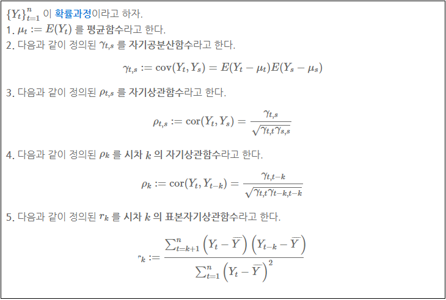
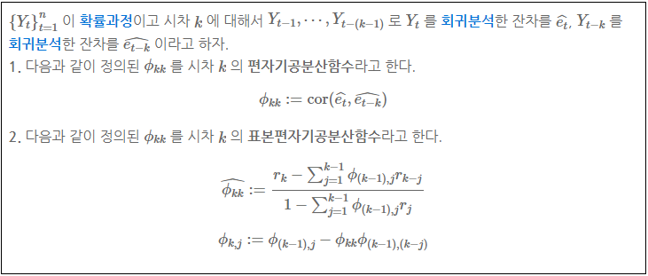
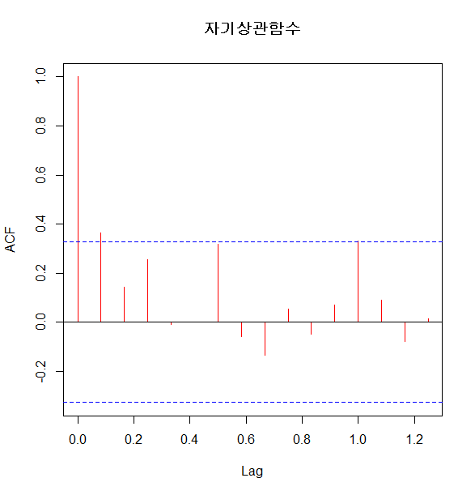
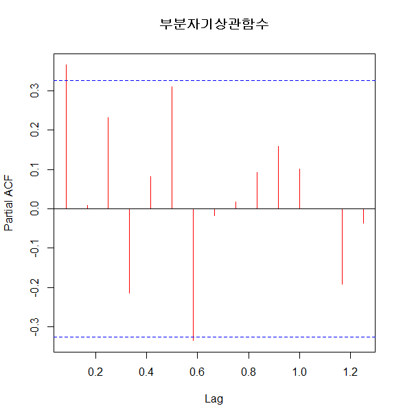
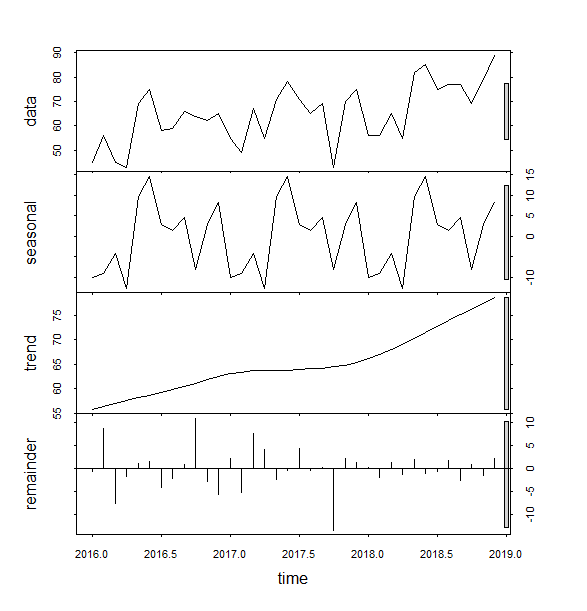
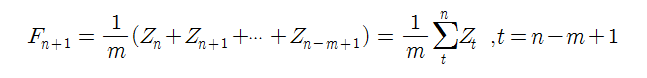
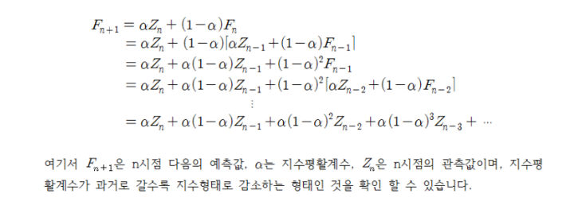
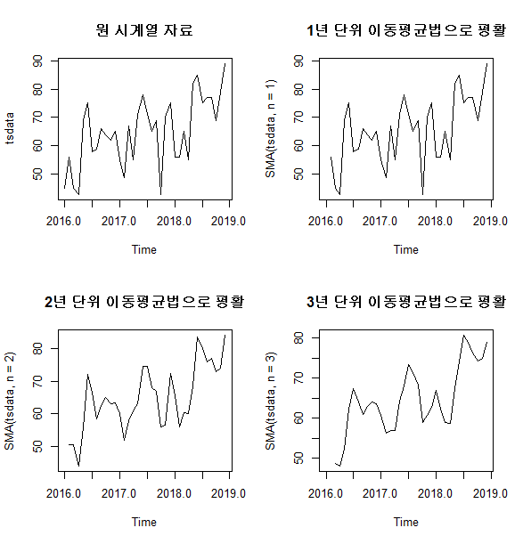

# R_Time_series

> 시간에 따라 변하는 데이터를 시간을 변수로 두고 상관관계를 찾는 방법

> 


## 0-1 자기상관함수 (ACF = autoregressive function)

## 0-2 편자기상관함수 ( PACF = partial autoregressive funtion)

> 어떤 주기가 데이터에 영향을 미치는가에 대한 분석 함수
>
> *ACF*
>
> 
>
> *PACF*
>
> 

```R
#################자기 상관 함수 ###########################
input <- c(3180,3000,3200,3100,3300,3200,3400,3550,3200,3400,3300,3700) 


# 추세선 시각화
plot(tsdata, type="l", col='red')

#자기 상관 함수 시각화
acf(na.omit(tsdata), main="자기상관함수", col="red")

#파란점선은 유의미한 자기 상관관계에 대한 임계값을 의미
#모든 시차(Lag)가 파란 점선 안에 있기 때문에 서로 이웃한 시점 간의 자기 상관성은 없는 것으로 해석

```



```R
#부분 자기 상관 함수 시각화
pacf(na.omit(tsdata), main="부분자기상관함수", col="red") 
#주기 생성에 어떤 종류의 시간 간격이 영향을 미치는지 보여줌
#간격 0.5에서 가장 작은 값(-0.5)를 나타냄
#모든 시차가 파란 점선 안쪽에 있기 때문에 주어진 시점 간의 자기 상관성은 없는 것으로 해석
```





## 1.시계열 요서 분해법

> 각 요인(추세, 순환, 계절, 불규칙)을 시각적 확인

```R
#################### 시계열 요소 분해 시각화 #######################
library(stats)
data <- c(45, 56, 45, 43, 69, 75, 58, 59, 66, 64, 62, 65, 
          55, 49, 67, 55, 71, 78, 71, 65, 69, 43, 70, 75, 
          56, 56, 65, 55, 82, 85, 75, 77, 77, 69, 79, 89)
length(data)# 36

# 시계열자료 생성 : 시계열자료 형식으로 객체 생성
tsdata <- ts(data, start=c(2016, 1), frequency=12) 
tsdata    # 2016~2018

# 추세선 확인 
par(mfrow=c(1,1))
ts.plot(tsdata)  #각 요인(추세, 순환, 계절, 불규칙)을 시각적 확인

#시계열 분해  - 시계열 변동 요인 분석-> 시계열 모델을 선정하기 위해
plot(stl(tsdata, "periodic"))  #주기적
#잔차는 회귀식에 의해 추정된 값과 실제 값의 차이 - 계절과 추세 적합 결과에 의해서 나타남

#시계열 분해, 변동요인 제거
m<- decompose(tsdata)
attributes(m)
plot(m)       #추세, 계정, 불규칙 요인 포함 시각화
plot(tsdata - m$seasonal)  #계절 요인을 제거한 시각화
plot(tsdata - m$trend)    #계절 요인을 제거한 시각화
plot(tsdata - m$seasonal - m$trend)  #불규칙 요인만 시각화
```




## 2. 평활법

[참고 사이트](https://m.blog.naver.com/muzzincys/220357284238)

> 1. 이동평균법 - MA(moving average)
>
>    (특정 기간의 평균을 제거하여 - 계절변동과 불규칙변동의 제거 - 순환변동만 가지는 시계열로 변환)
>
> 
>
> 2. 지수평활법 - 모든 시계열의 평균을 구하여, 최근의 흐름에 더 많은 가중치를 부여한다.
>
> 

```R
#########이동평균(Moving Average) 평활법 ###################  
data <- c(45, 56, 45, 43, 69, 75, 58, 59, 66, 64, 62, 65, 
          55, 49, 67, 55, 71, 78, 71, 65, 69, 43, 70, 75, 
          56, 56, 65, 55, 82, 85, 75, 77, 77, 69, 79, 89)

# 시계열자료 생성 : 시계열자료 형식으로 객체 생성
tsdata <- ts(data, start=c(2016, 1), frequency=12) 
tsdata    # 2016~2018

install.packages("TTR")
library(TTR)

# 이동평균법으로 평활 및 시각화
par(mfrow=c(2, 2))
plot(tsdata, main="원 시계열 자료") # 시계열 자료 시각화
plot(SMA(tsdata, n=1), main="1년 단위 이동평균법으로 평활")
plot(SMA(tsdata, n=2), main="2년 단위 이동평균법으로 평활")
plot(SMA(tsdata, n=3), main="3년 단위 이동평균법으로 평활")

#가장 평탄한 형태로 분포된 결과를 선정하여 추세를 예측하는데 사용
#평균으로 평활한 결과가 가장 평탄한 값으로 나타나는 값은  3년 단위 이동평균법으로 평활한 것

```




## 3. ARIMA

> * 정상성을 가진 시계열 모형
>
> • 뚜렷한 추세가 없는 시계열
>
> • 시계열의 평균이 시간 축에 평행하게 나타난다
>
> • 사용 모델 : 자기회귀모형(AR), 이동평균모형(MA), 자기회귀이동평균모형(ARMA)
>
> 
>
> * 비정상성을 가진 시계열 모형  
>
> • 대부분의 시계열 자료는 비정상성 시계열의 형태를 갖는다.
>
> • 자기회귀 누적이동평균모형(ARIMA) 
>
> ​	–***3개의 인수(p는 자기회귀모형 차수, d는 차분 차수, q는 이동평균모형의 차수)***를 갖는다
>
> • 시계열 자료 Yt를 d번 차분한 결과가 정상성 시계열의 ARIMA(p, q) 모형이라면,
>
>   시계열 Yt는 차수 d를 갖는 ARIMA(p, d, q)모형이 된다.
>
> 
>
> * ARIMA  모형  시계열 자료 처리 절차
>
> • 식별(Identification) – ARIMA의 3개의 차수  (p, d, q)를 결정하는 단계, 현재 시계열 자료가 어떤 모형(AR, MA, ARMA)에 해당하는가를 판단하는 단계, 식별의 수단으로 자기 상관 함수(acf)와 부분 자기 상관 함수(pacf)를 이용
>
> • 추정(Estimation) – 식별된 모형의 파라미터를 추정하는 단계, 최소제곱법을 이용
>
> • 진단(Diagnosis) – 모형식별과 파라미터 추정에 의해서 생성된 모형이 적합한지를 검증하는 단계, 적합성 검증의 수단으로 잔차가 백색 잡음(white noise)인지를 살펴보고, 백색 잡음과 차이가 없으면 적합하다고 할 수 있다


```R
#######계절성 없는  데이터의 정상성 시계열의 ARIMA  모델 분석 ##############

input <- c(3180,3000,3200,3100,3300,3200,3400,3550,3200,3400,3300,3700) 

#시계열객체 생성(12개월 : 2015년 2월 ~ 2016년 1개)
tsdata <- ts(input, start=c(2015, 2), frequency=12) 
tsdata

# 추세선 시각화
plot(tsdata, type="l", col='red')

# 정상성시계열 변환
par(mfrow=c(1,2))
ts.plot(tsdata)
diff <- diff(tsdata)
plot(diff) # 차분 : 현시점에서 이전시점의 자료를 빼는 연산

# auto.arima() : 시계열 모형을 식별하는 알고리즘에 의해서 최적의 모형과 파라미터를 추정하여 제공
install.packages('forecast')
library(forecast)
arima <- auto.arima(tsdata) # 시계열 데이터 이용 
arima
# ARIMA(1,1,0) - 자기 회귀 모형 차수 1, 차분 차수 1
# 1번 차분한 결과가 정상성 시계열 ARMA(1, 0) 모형으로 나타남
# AIC=148.8 는 이론적 예측력 (모형의 적합도 지수로 값이 적은 모형을 채택한다.)
# d =0 이면, ARMA(p, q) 모형이며, 정상성을 만족합니다
# p =0 이면, IMA(d, q) 모형이며, d번 차분하면 MA(q) 모형을 따른다
# q=0이면, IAR(p, d) 모형이며, d번 차분하면 AR(p) 모형을 따른다


####  모형 생성 
model <- arima(tsdata, order=c(1, 1, 0))
model 

#모형의 계수값과 표준 오차를 확인


####모형 진단(모형 타당성 검정)

# (1) 자기상관함수에 의한 모형 진단
tsdiag(model)
#잔차의 ACF에서 자기 상관이 발견되지 않고, p value값이 0 이상으로 분포되어 있으므로
# ARIMA 모형은 매우 양호한 시계열 모형이라고 진단할 수 있다

# (2) Box-Ljung에 의한 잔차항 모형 진단
Box.test(model$residuals, lag=1, type = "Ljung")   #p-value가 0.725
#  p-value가 0.05이상이면 모형이 통계적으로 적절하다고 볼 수 있다 

# 미래 예측(업무 적용)
fore <- forecast(model) # 향후 2년 예측
fore
par(mfrow=c(1,2))
plot(fore) # 향후 24개월 예측치 시각화 
model2 <- forecast(model, h=6) # 향후 6개월 예측치 시각화 
plot(model2)

######계절성 있는 데이터의 정상성시계열의 ARIMA 모델 분석########
data <- c(45, 56, 45, 43, 69, 75, 58, 59, 66, 64, 62, 65, 
          55, 49, 67, 55, 71, 78, 71, 65, 69, 43, 70, 75, 
          56, 56, 65, 55, 82, 85, 75, 77, 77, 69, 79, 89)
length(data)# 36

# 시계열자료 생성 
tsdata <- ts(data, start=c(2016, 1), end = c(2018, 10),frequency=12)
tsdata 
head(tsdata)
tail(tsdata)


#시계열요소분해 시각화
ts_feature <- stl(tsdata, s.window="periodic")
plot(ts_feature)
#계절성이 뚜렷하게 나타남


# 단계2 : 정상성시계열 변환
par(mfrow=c(1,2))
ts.plot(tsdata)
diff <- diff(tsdata)  
plot(diff) # 차분 시각화


# 단계3 : 모형 식별과 추정
library(forecast)
ts_model2 <- auto.arima(diff)
ts_model2

# ARIMA(2,1,0) - 자기 회귀 모형 차수 2, 차분 차수 1
# 1번 차분한 결과가 정상성 시계열 ARMA(2, 0) 모형으로 나타남
# ARIMA 두번째 파라미터 (1, 0, 0)는 계절성을 갖는 자기회귀(AR) 모형 차수가 1로 나타남 =>계절성을 갖는 시계열이라는 의미
# [12]는 계절의 차수가 12개월임을 의미함
# 계수(Coefficients)는 자기회귀 모형의 차수 2(ar1, ar2)와 계절성 자기회귀 차수(sar1)에 대한 계수값임을 나타냄


# 단계4 : 모형 생성 
model <- arima(tsdata, c(2, 1, 0), 
               seasonal = list(order = c(1, 0, 0)))
model
#모형의 계수값과 표준 오차를 확인


# 단계5 : 모형 진단(모형 타당성 검정)
# (1) 자기상관함수에 의한 모형 진단
tsdiag(model)
#잔차의 ACF에서 자기 상관이 발견되지 않고, p value값이 0 이상으로 분포되어 있으므로
# ARIMA 모형은 매우 양호한 시계열 모형이라고 진단할 수 있다


# (2)Box-Ljung에 의한 잔차항 모형 진단
Box.test(model$residuals, lag=1, type = "Ljung")  #0.593

#  p-value가 0.05이상이면 모형이 통계적으로 적절하다고 볼 수 있다 


# 단계6 : 미래 예측
par(mfrow=c(1,2))
fore <- forecast(model, h=24) # 2년 예측 
plot(fore)
fore2 <- forecast(model, h=6) # 6개월 예측 
plot(fore2)


##########시계열 분석 연습문제 1 #####################
#시계열 자료를 대상으로 다음 단계별로 시계열 모형을 생성하고, 미래를 예측하시오.
#<데이터 셋 준비>
data(EuStockMarkets)
head(EuStockMarkets)
EuStock<- data.frame(EuStockMarkets)
head(EuStock)
Second <- c(1:500) # 초단 단위로 벡터 생성
DAX <- EuStock$DAX[1001:1500] # DAX 칼럼으로 백터 생성
EuStock.df <- data.frame(Second, DAX) # 데이터프레임 생성
EuStock.df

#단계1 : 시계열자료 생성 : EuStock.df$DAX 칼럼을 대상으로 2001년1월 단위

tsdata <- ts(EuStock.df$DAX, start = c(2001, 01),frequency=12)
head(tsdata)

#단계2 : 시계열 자료 분해
#(1) stl() 함수 이용 분해 시각화
plot(stl(tsdata, "periodic"))
#(2) decompose() 함수 이용 분해 시각화, 불규칙요인만 시각화

par(mfrow = c(2,2))
m<- decompose(tsdata)
attributes(m)
plot(m)       #추세, 계정, 불규칙 요인 포함 시각화
plot(tsdata - m$seasonal)  #계절 요인을 제거한 시각화
plot(tsdata - m$trend)    #계절 요인을 제거한 시각화

#(3) 계절요인추세요인 제거 그래프-불규칙요인만 출력

plot(tsdata - m$seasonal - m$trend)  #불규칙 요인만 시각화


#단계3 : ARIMA 시계열 모형 생성

ts_model2 <- auto.arima(tsdata)
ts_model2

model <- arima(tsdata, c(2, 1, 2), 
               seasonal = list(order = c(1, 0, 2)))
model
tsdiag(model)
Box.test(model$residuals, lag=1, type = "Ljung")

# 단계4 : 향후 3년의 미래를 90%와 95% 신뢰수준으로 각각 예측 및 시각화

par(mfrow=c(1,2))
fore <- forecast(model, h=36) # 2년 예측 
plot(fore)


##########시계열 분석 연습문제 2 #####################
#Sales.csv 파일을 대상으로 시계열 자료를 생성하고, 각 단계별로 시계열 모형을 생성하여 예측하시오.

goods <- read.csv("C:/Users/student/Desktop/datafile-II/data-4/data-4/Sales.csv", header = TRUE)

# 단계1 : 시계열 자료 생성 : goods$Goods 칼럼으로 2015년 1월 기준 12개월 단위

tsdata <- ts(goods$Goods, start = c(2015,01), frequency = 12)
head(tsdata)
# 단계2 : 시계열모형 추정과 모형 생성

ts_model2 <- auto.arima(tsdata)
ts_model2

model <- arima(tsdata, c(0, 1, 0), 
               seasonal = list(order = c(1, 1, 0)))
model
tsdiag(model)

# 단계3 : 시계열모형 진단 : Box-Ljung 검정 이용

Box.test(model$residuals, lag=1, type = "Ljung")

# 단계4 : 향후 7개월 예측

par(mfrow=c(1,1))
fore <- forecast(model, h=7) # 2년 예측 

# 80% 신뢰구간(Lo 80~Hi80), 95% 신뢰구간(Lo 95 ~ Hi 95)
# 단계5 : 향후 7개월 예측결과 시각화

plot(fore)

```

