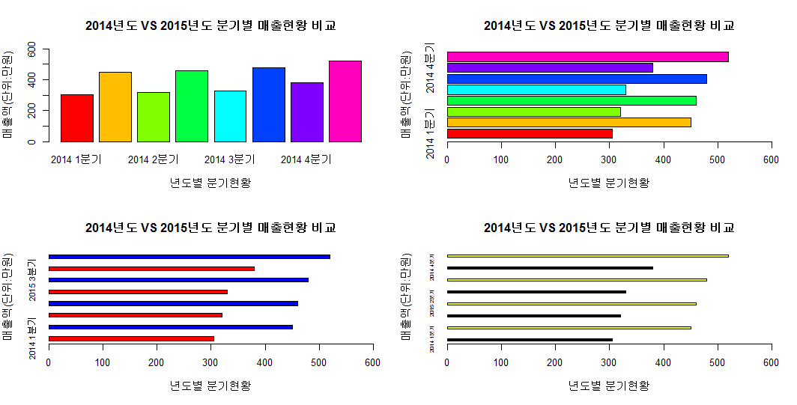
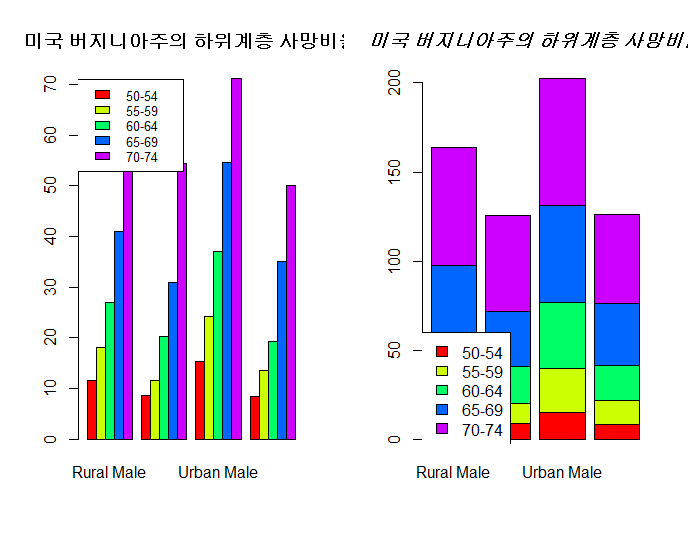
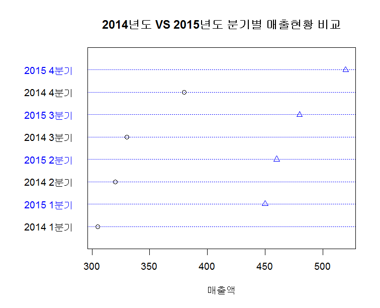
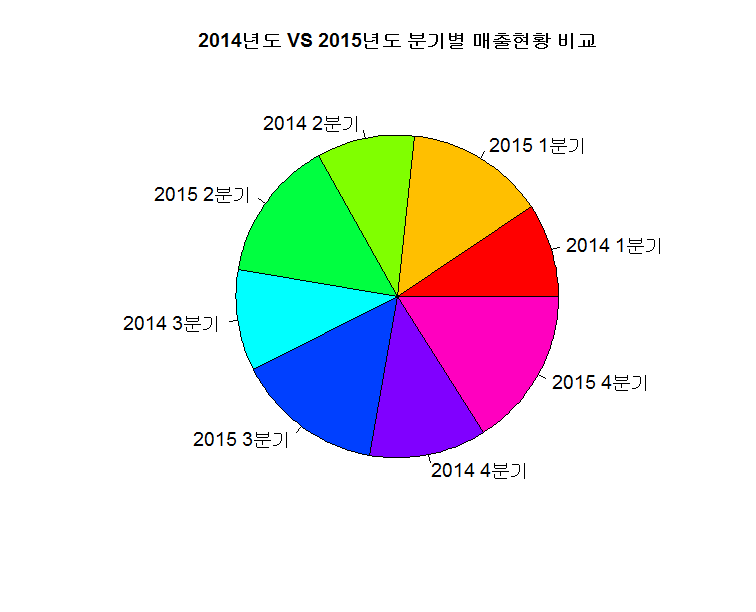
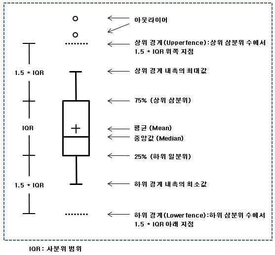
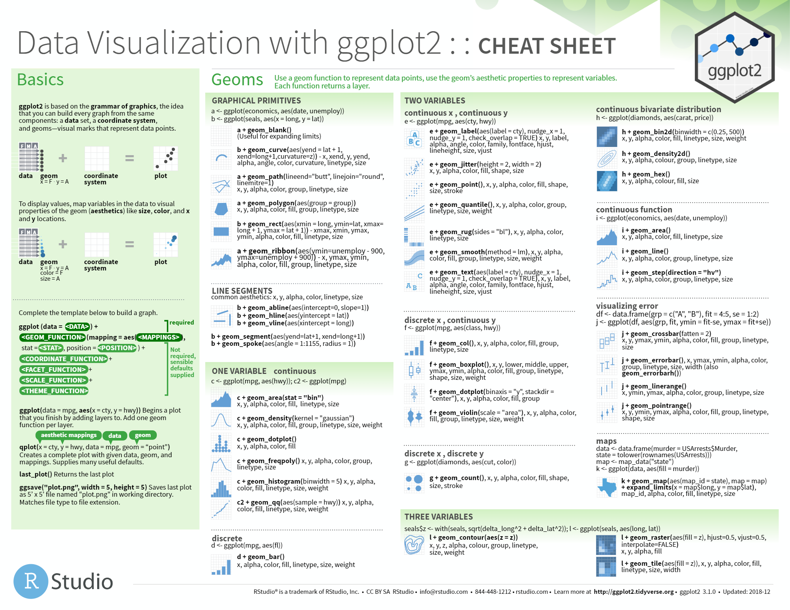
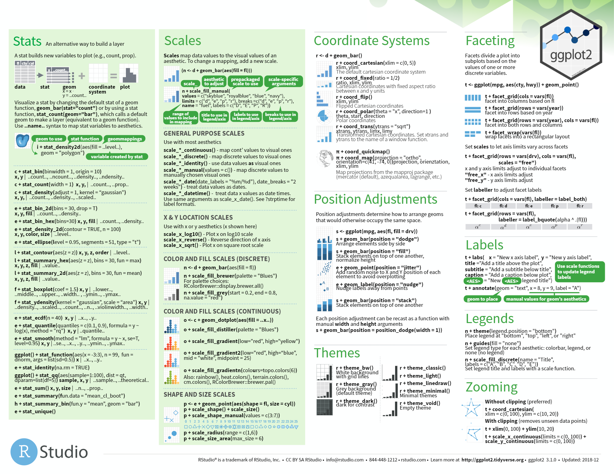

# *R_visualization*

> package - graphics(plot 제공 ), lattice(다변량 데이터), ggplot2(문법적 그래픽), ggamp(지도)
>
> function - plot(그래프), points(점), abline(),lines(),arrows(),segments()(선) , 


## 0 . 저수준 그래픽

### 0-1. 요소 함수

- 점 - points()

- 선 
  - abline() - a(기울기), b(절편), h(horizontal), v(vertical), coef(선형 계수), reg()
  - lines() - (시작점, 끝점, lty = (선종류1~6))
  - 화살표 - arrows() - (angle(화살표 각도),length(화살표 길이), code(화살표 방향))
  - segments() - lines()와 기능은 동일 - 꺽은선을 여러 그룹 동시에 표시할 때 사용

- 면

  - box() - outer/inner(테두리), plot(플롯 테두리), figure(그림의 테두리)
  - rect() - 사각 도형 (x-left, y-bottom, x-right, y-top, [lwd=n(테두리 굵기),col = , density = , angle = , lty =])
  - polygon() - 다각형 (plot()처럼 좌표 지정 , rect()처럼 옵션 설정)

- 문자

  - title() - plot의 각 타이틀 - main, sub, xlab, ylab 적용 - text(내부 설정)도 가능하고 각각도 사용 가능
  - text() - 원하는 위치 지정 (x, y,  lable = "내용", [adj = 정렬방식(0-왼정렬, 1-오른정렬,0.5-가운데정렬)]) 
  - expression(), plotmath - 수식
  - mtext() - margin에 text를 지정한다.

- 범례

  - legend() - (x,y 좌표) or ("top,bottom,left,right,center"조합 가능) or (locator()로 마우스 설정 가능)

    (위치 다음, "내용", [fill =,pch=,title=,col=,lty=,density= ]등 설정 가능)

- 좌표축
  - axis() - (side = 1(위), 3(아래),2(왼),4(오) 마진을 의미, [at=,lables=벡터,col.axis=,col=,pos=,lty=,lwd=,tick=T/F(선 있고 없고)])

- 격자
  - grid() - (x축 분할개수, y축 분할개수, [lty=,lwd,=col=])
- 데이터 특징
  - (1차원 밀도) - rug() - (데이터, side = margin 위치, [col=,ticksize=])
  - (산점 테두리) - chull() - (데이터)


### 0-2. par()

> plot을 출력하는 여러 그래픽 인수를 가짐

#### 0-2-1. par() 의 인수

```R
# mfrow, mfcol = c(n,n) 	# (대칭으로 분할) 플롯 영역에 나타낼 그래프 개수
# layout() 					# (비대칭으로도 가능) layout(mat = matrix(c(1,1,2,3),ncol=2))
	# layout.show 			# layout의 구분선을 그린다
# fig, split.screen			# 자세히 다루지 않는다. (보다 정교하게 분할 가능)
# new						# T/F 옵션으로 그래프 더하기, 덮어쓰기 지정
# bty						# 그래프 테두리 옵션
# pty						# 플롯 영역 ("s"(동일 비율),"m"(최대 비율))
# type						# 데이터가 표현되는 형태 (p-점,b-점+선,c-선,o-점+선,s-꺽은선)
# pch						# 점을 대신할 문자 지정
# lty						# 선 종류
# xlab, ylab
# xlim, ylim
# col
# cex 						# 문자나 점 크기
# str						# 문자의 회전 출력에 사용 ["str = n(각도)"]
# tck						# 좌표 눈금선
# tcl
# mar						# 여백 조정
# oma						# 바깥 여백
# family, font				# 폰트
# fg,bg						# 컬러 설정
```


> **PROCESS**

```R
1. 데이터 분석의 도입부 : 전체적인 데이터의 구조를 분석하거나 분석 방향을 제시
2. 데이터 분석의 중반부 : 잘못된 처리 결과를 확인
3. 데이터 분석의 후반부 : 분석결과를 도식화하여 의사결정에 반영하기 위해서 데이터를 시각화

# 이산변수로 구성된 데이터 셋을 이용하여 막대, 점, 원형 차트를 그릴 수 있다.
# 연속변수로 구성된 데이터프레임을 대상으로 히스토그램과 산점도를 그릴 수 있다.

** 데이터 분석의 도입부에서 전체적인 데이터의 구조를 살펴보기 위해서 시각화 도구를 사용한다.
	
	- 숫자형 컬럼 1개 시각화 도구 - hist, plot, barplot
	- 범주형 컬럼 1개 시각화 도구 - pie, barplot
	- 숫자형 컬럼 2개 시각화 도구 - plot, abline, boxplot
	- 숫자형 컬럼 3개 시각화 도구 - scatterplot3d(3차원 산점도)
	- n개의 컬럼 시각화 도구 - pairs(산점도 매트릭스)
```


## 1. barplot 그리기

> 세로, 가로 막대 그래프

### 1-1. barplot 의 매개변수

> 주요 변수 : ylim(y축 범위), col(막대 색상) , main(제목)

```bash
Bar Plots
Description
Creates a bar plot with vertical or horizontal bars.

Usage
barplot(height, ...)

## Default S3 method:
barplot(height, width = 1, space = NULL,
        names.arg = NULL, legend.text = NULL, beside = FALSE,
        horiz = FALSE, density = NULL, angle = 45,
        col = NULL, border = par("fg"),
        main = NULL, sub = NULL, xlab = NULL, ylab = NULL,
        xlim = NULL, ylim = NULL, xpd = TRUE, log = "",
        axes = TRUE, axisnames = TRUE,
        cex.axis = par("cex.axis"), cex.names = par("cex.axis"),
        inside = TRUE, plot = TRUE, axis.lty = 0, offset = 0,
        add = FALSE, ann = !add && par("ann"), args.legend = NULL, ...)
```

### 1-2. barplot 실습

```R
#세로 막대 차트

chart_data <- c(305, 450, 320, 460, 330, 480, 380, 520)
names(chart_data) <- c("2014 1분기","2015 1분기"
                      , "2014 2분기", "2015 2분기"
                      , "2014 3분기", "2015 3분기"
                       , "2014 4분기", "2015 4분기"
)
str(chart_data)
print(chart_data)

# 그래프 4칸 보기설정
par(mfrow=c(2,2))

# graph (1,1) 세로 막대
barplot(chart_data, ylim=c(0, 600),  col=rainbow(8),
        main="2014년도 VS 2015년도 분기별 매출현황 비교",
        ylab="매출액(단위:만원)", xlab="년도별 분기현황")

# garph (1,2) 가로 막대 차트 : horiz=TRUE
barplot(chart_data, xlim=c(0, 600), horiz=TRUE,  col=rainbow(8),
        main="2014년도 VS 2015년도 분기별 매출현황 비교",
        ylab="매출액(단위:만원)", xlab="년도별 분기현황")

# graph (2,1)
#막대의 굵기와 간격 지정 : space (값이 클수록 막대의 굵기는 작아지고, 간격은 넓어진다)
#축 이름 크기 설정 : cex.names
barplot(chart_data, xlim=c(0, 600), horiz=TRUE, 
       main="2014년도 VS 2015년도 분기별 매출현황 비교",
        ylab="매출액(단위:만원)", xlab="년도별 분기현황"
        , space=2, cex.names=0.8, col=rep(c(2, 4), 4))

# graph (2,2)
#색상 index값 : 검은색(1), 빨간색(2), 초록색(3), 파란색(4), 하늘색(5), 자주색(6), 노란색(7)
barplot(chart_data, xlim=c(0, 600), horiz=TRUE, 
       main="2014년도 VS 2015년도 분기별 매출현황 비교",
        ylab="매출액(단위:만원)", xlab="년도별 분기현황"
        , space=5, cex.names=0.5, col=rep(c(1, 7), 4))

```



```R
# 누적 barplot

data(VADeaths)
str(VADeaths)    #5행 4열
class(VADeaths)  #matrix
mode(VADeaths)   # numeric
head(VADeaths, 10)
# VADeaths 데이터셋은 1940년 미국 버지니아주의 하위계층 사망비율을 기록한 데이터셋

par(mfrow=c(1, 2)) 
barplot(VADeaths, beside=T, col=rainbow(5), 
        main="미국 버지니아주의 하위계층 사망비율")
#범례 출력
legend(0,71, c("50-54", "55-59", "60-64", "65-69", "70-74")
       , cex=0.8, fil=rainbow(5))

#누적막대 차트
barplot(VADeaths, beside=F, col=rainbow(5) )
title(main="미국 버지니아주의 하위계층 사망비율", font.main=4)
legend(0,60, c("50-54", "55-59", "60-64", "65-69", "70-74")
       , cex=1, fil=rainbow(5))

#beside=T/F : X축 값이 측면으로 배열, F이면 하나의 막대에 누적
#font.main : 제목 글꼴 지정
#legend() : 범례 위치, 이름, 글자 크기, 색상 지정
#title() : 차트 제목, 차트 글꼴 지정
```



---


## 2. plot 그리기

> 산점도

### 2-1. plot 의 매개변수

> 주요 변수: labels : 점 설명, cex : 점 크기, pch : 점 모양 [원(1), 삼각형(2),.,], color : 색상, lcolor : 선 색상

```bash
**Arguments**

x	- the coordinates of points in the plot. Alternatively, a single plotting structure, 		function or any R object with a plot method can be provided.

y	- the y coordinates of points in the plot, optional if x is an appropriate structure.

type - what type of plot should be drawn. Possible types are

"p" for points,
"l" for lines,
"b" for both,
"c" for the lines part alone of "b",
"o" for both ‘overplotted’,
"h" for ‘histogram’ like (or ‘high-density’) vertical lines,
"s" for stair steps,
"S" for other steps, see ‘Details’ below,
"n" for no plotting.

main 	- an overall title for the plot: see title.
sub 	- a sub title for the plot: see title.
xlab 	- a title for the x axis: see title.
ylab 	- a title for the y axis: see title.
asp 	- the y/x aspect ratio, see plot.window.
```

### 2-2 plot 실습

```R
par(mfrow=c(1, 1)) 
dotchart(chart_data, color=c("geen", "yellow"), lcolor="blue", 
        pch=1:2, labes=names(chart_data), xlab="매출액", 
        main="2014년도 VS 2015년도 분기별 매출현황 비교"
        , cex=1.2)
```



---


## 3. pieChart 그리기

> 원형 그래프

### 3-1. pieChart 의 매개변수

```bash
**Usage**

pie(x, labels = names(x), edges = 200, radius = 0.8,
    clockwise = FALSE, init.angle = if(clockwise) 90 else 0,
    density = NULL, angle = 45, col = NULL, border = NULL,
    lty = NULL, main = NULL, ...)
```

### 3-2 pieChart 실습

```R
par(mfrow=c(1, 1)) 
pie(chart_data, col=rainbow(8),  
        pch=1:2, labels=names(chart_data),   
        main="2014년도 VS 2015년도 분기별 매출현황 비교"
        , cex=1.2)
```



## 4. boxplot 그리기

> 아래처럼 데이터의 특징을 한 눈에 살펴볼 수 있는 그래프





### 4-1. boxplot 의 매개변수

```R
Usage
boxplot(x, ...)

## S3 method for class 'formula'
boxplot(formula, data = NULL, ..., subset, na.action = NULL,
        xlab = mklab(y_var = horizontal),
        ylab = mklab(y_var =!horizontal),
        add = FALSE, ann = !add, horizontal = FALSE,
        drop = FALSE, sep = ".", lex.order = FALSE)

## Default S3 method:
boxplot(x, ..., range = 1.5, width = NULL, varwidth = FALSE,
        notch = FALSE, outline = TRUE, names, plot = TRUE,
        border = par("fg"), col = NULL, log = "",
        pars = list(boxwex = 0.8, staplewex = 0.5, outwex = 0.5),
         ann = !add, horizontal = FALSE, add = FALSE, at = NULL)
```

### 4-2. boxplot 실습

```R
#연속변수(Continuous quantitative data)는 시간, 길이 등과 같이 연속성을 가진 변수
#boxplot은 요약 정보를 시각화하는데 효과적
#데이터의 분포 정도와 이상치 발견을 목적으로 하는 경우 유용하게 사용된다.
boxplot(VADeaths, range=0) #컬럼의 최대값과 최속밧을 점선으로 연결
#notch=T : 중위수(허리선) 비교
boxplot(VADeaths, range=0, notch=T )
#abline() : 기준선 추가(선 스타일, 선 색상)
abline(h=37, lty=3, col="red")
```


## 5. histogram 그리기


### 5-1. histogram 의 매개변수

```R
Usage
hist(x, ...)

## Default S3 method:
hist(x, breaks = "Sturges",
     freq = NULL, probability = !freq,
     include.lowest = TRUE, right = TRUE,
     density = NULL, angle = 45, col = NULL, border = NULL,
     main = paste("Histogram of" , xname),
     xlim = range(breaks), ylim = NULL,
     xlab = xname, ylab,
     axes = TRUE, plot = TRUE, labels = FALSE,
     nclass = NULL, warn.unused = TRUE, ...)
```

### 5-2. histogram 실습

```R

# 히스토그램 -  측정값의 범위(구간)를 그래프의 x축으로 놓고, 범위에 속하는 측정값의 출현 빈도수를 y축으로 나타낸 그래프 형태
# 히스토그램의 도수의 값을 선으로 연결하면 분포곡선을 얻을 수 있다
str(iris)     #data.frame, 
head(iris)

summary(iris$Sepal.Length) #꽃받침 길이의 요약 통계

hist(iris$Sepal.Length, xlab="iris$Sepal.Length", 
     col="magenta", main="꽃받침 길이 histogram" , xlim=c(4.3, 7.9))
```


## 6. plot으로 (산점도, scatter plot) 그리기

> 점으로 데이터의 분산 정도를 나타낸 그래프

### 6-1. scatter plot 실습

```R
price <- runif(10, min=1, max=100)
print(price)
plot(price, col="red")
par(new=T) #차트 추가
line_chart=1:100
#x축은 생성된 난수의 순서,  y축은 
plot(line_chart, type="l", col="red", axes=F, ann=F) #대각선 추가 


#좌표평면상의 점 등을 선으로 연결
par(mfrow=c(2, 2))
plot(price, type="l")  #실선
plot(price, type="o")  #원형과 실선
plot(price, type="h")  #직선
plot(price, type="s")  #꺽은선

# 중복된 데이터의 수만큼 plot점 크기 확대
x <- c(1,2,3,4,2,4)
y <- rep(2,6)
table(x, y)

par(mfrow=c(1,1))
plot(x,y)

xy.df <- as.data.frame(table(x,y))
xy.df


plot(x, y, pch = '@', col = 'blue', cex = 0.5*xy.df$Freq, xlab = "x벡터 원소", ylab = "y벡터 원소")

install.packages("psych")
library(psych)
data(galton)

#child컬럼, parent컬럼을 대상으로 교차테이블을 생성
galtondf <- as.data.frame(table(galton$child, galton$parent))
head(galtondf)
str(galtondf)

names(galtondf) <-c("child", "parent", "freq")
head(galtondf)
parent <- as.numeric(galtondf$parent)
child <- as.numeric(galtondf$child)

plot(parent, child, pch=21, col="blue", bg="green", 
     cex=0.2*galtondf$freq, xlab="parent", ylab="child")
```


## 7. 3차원 산점도

### 7-1. 3차원 산점도 실습

```R
install.packages("scatterplot3d")
library(scatterplot3d)
levels(iris$Species)
iris_setosa = iris[iris$Species=='setosa', ]
iris_versicolor = iris[iris$Species=='versicolor', ]
iris_virginica = iris[iris$Species=='virginica', ]
d3 <- scatterplot3d(iris$Petal.Length, iris$Sepal.Length,
      iris$Sepal.Width, type='n')  #type='n'은 기본 산점도를 표시하지 않음

d3$points3d(iris_setosa$Petal.Length, iris_setosa$Sepal.Length ,
            iris_setosa$Sepal.Width, bg="orange", pch=21)

d3$points3d(iris_versicolor$Petal.Length, iris_versicolor$Sepal.Length ,
            iris_versicolor$Sepal.Width, bg="blue", pch=23)

d3$points3d(iris_virginica$Petal.Length, iris_virginica$Sepal.Length ,
            iris_virginica$Sepal.Width, bg="green", pch=25)
```


 

---


# ***ggplot2 이용하여 그리기***

> [참고사이트](https://ggplot2.tidyverse.org/)




