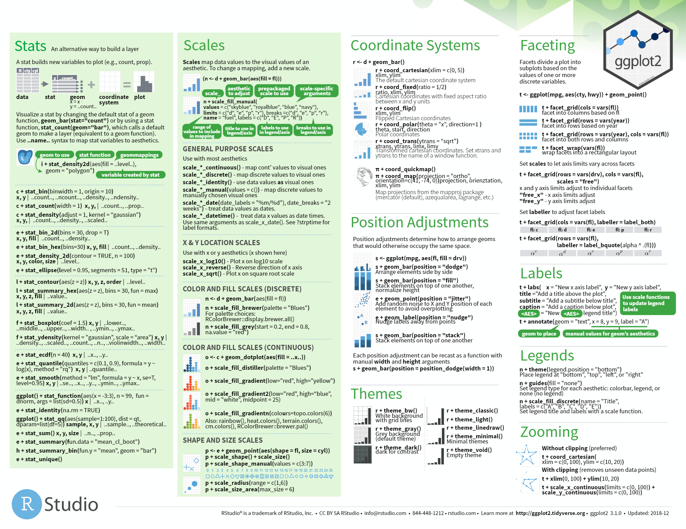

# ***ggplot2 이용하여 그리기***

> [참고사이트](https://ggplot2.tidyverse.org/)




## 함께 사용하면 좋은 패키지

### googleVis

```
install.packages("googleVis")
library(googleVis)

motion <- gvisMotionChart(economics, idvar = "psavert", timevar = "date")
plot(motion)
```

### gridExtra

```R
install.packages("gridExtra")
library(gridExtra)


grid.arrange(a,b,c,layout_matrix=cbind(c(1,1,2,3)))
# x축 상영시간 , y축 장르별 필름 수
a = qplot(data = Movie_2016, runtime, fill = genre, bins = 30)

#상영시간이 가장 긴 필름의 장르는?

b= ggplot(Movie_2016,aes(x=runtime,y=rating))+ geom_point(aes(size=votes,col=genre))
#상영시간이 130-160 분인 장르중 votes가 가장 높은 것은?
c =ggplot((Movie_2016 %>% filter(as.numeric(runtime) >= 130 & as.numeric(runtime) <=160)),aes(x=runtime, y=rating)) + geom_point(aes(size=votes, col=genre))

```


### 