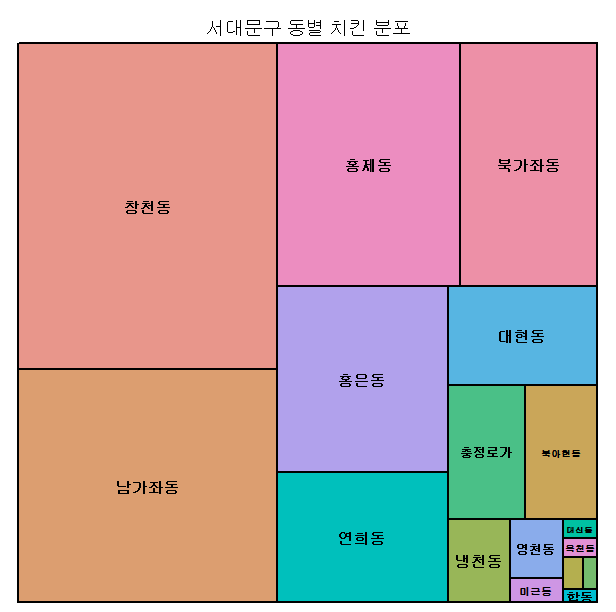

# 상점 밀집지역 찾기

## 1. 데이터 다운로드

- [로컬 데이터](http://www.localdata.kr/) - 지역 다운로드 - 서울특별시 - 데이터 정제 (./data 폴더 참고)

------

## 2. 필요 패키지 install / load

```R
install.packages("readxl")
install.packages("dplyr")
install.packages("psych")

library(readxl)
library(dplyr)
library(psych)
```

## 3. 데이터  load, 정제

```R
# 파일 불러오기
storedata <- read_excel("C:/Users/student/Desktop/git_repository/R/data/storeData.xlsx")

# 동이름만 남기기
addr <- gsub(" ","",(gsub("[0-9]","",substr(storedata$소재지전체주소,11,16)))

# > head(addr)
# [1] "창천동"   "창천동"   "창천동"   "남가좌동" "연희동"   "창천동"               
             
# DF 생성
addr_count <- addr %>% table() %>% data.frame()

# > head(addr_count)
# .Freq
# 1   창천동  395
# 2 남가좌동  282
# 3   홍제동  209
# 4 북가좌동  155
# 5   홍은동  150
# 6   연희동  104
```

- substr(데이터, 처음index, 끝index)
- gsub(조건식,"변경문자",대상)
- %>% - dplyr의 이음 연산자 (앞의 대상을 받아와 다음 메소드를 실행)


## 4. 트리 맵 그리기

```R
# 트리 맵 그리기
treemap(addr_count,index=".",vSize="Freq",title="서대문구 동별 치킨 분포")
```

- treemap(data, index=구분열, vSize=분포열,vColor="색상", title="제목")




